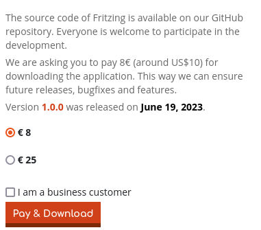
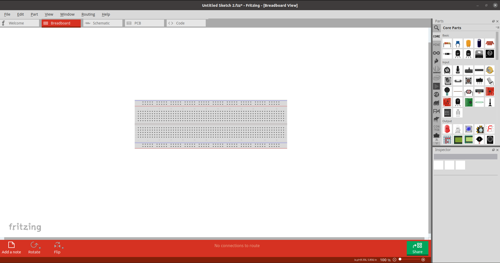
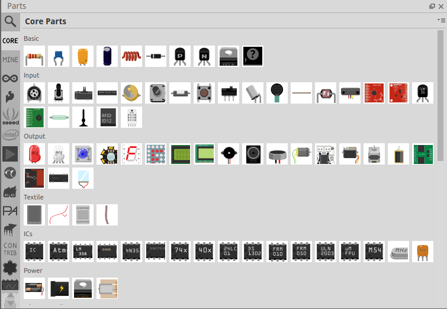
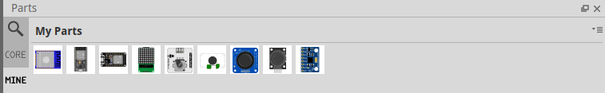
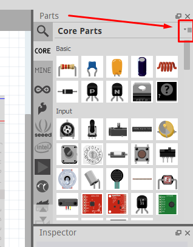
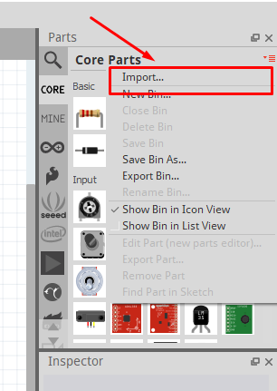
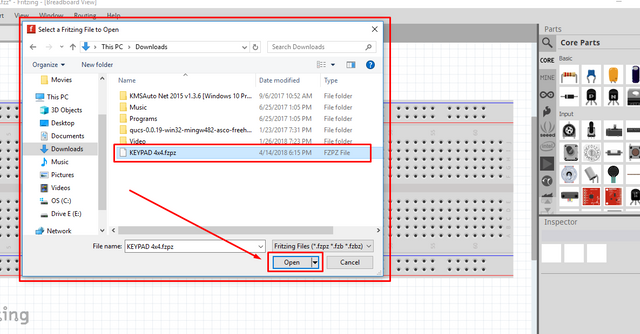
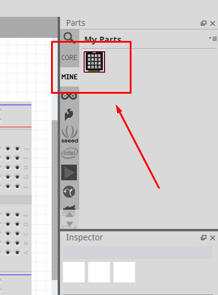

 # Tutorial Fritzing

*This tutorial is made by the GOAT TEAM (first Embedded SBG Internship course)*

---

`Fritzing` is an open-source hardware initiative that makes electronics accessible as a creative material for anyone. We offer a software tool, a community website and services in the spirit of Processing and Arduino, fostering a creative ecosystem that allows users to document their prototypes, share them with others, teach electronics in a classroom, and layout and manufacture professional PCBs.

But in the latest versions, you can not download `Fritzing` free. You must pay for it.

 ## How to install `Fritzing` for **FREE** on Ubuntu

 *Because you can not download the lastest version. So, we have a trick here. We download the lower version (the version is free) but it dose not have full devices or components we need.*

Installing fritzing package on Ubuntu is as easy as running the following command on terminal:

    sudo apt-get update
    sudo apt-get install fritzing

We will get `Fritizng version BETA 0.9.3`.

This is the GUI of Fritzing.

## `Core Parts`

In this app, you just need to focus on the `Core Parts` and `My Parts`.

Firts, the `Core Parts` is all components you already have in this Fritzing version.

## `My Parts`

In this version, you will be missing important components to be able to create complete circuits for your projects, such as ESP32 Module or Led Matrix Max7219.

To solve this problem, you need to know `My Parts`. Those are the components you add from external libraries.

## Import the new component to Fritzing software

To add a new component, you should follow all step below.

- Step 01: Enter " *your component* + *Fritzing Library* " on the GOOGLE (eg: ESP32 module Fritzing library)

- Step 02: Then, you need to download the file .fzpz, this file will be used for adding the componet you want in Fritizng.

- Step 03: To import the component, we go back to Fritzing software and look for "import" command. It is found under the drop down located at the right side of library.

    

    Click to reveal its menu options.

    

    When we click `import`, it will open a dialog box to search for the file to import. Make sure you know the location of the fzpz file you have downloaded to avoid hassle. Look for `your component`.fzpz and click `open`.

    

    After we click "open", we can now see in Mine category of the library our added component.

    

---

So, all above the information is the basic tutorial you need to use Fritzing Software.

You can access the link below to find out tips and trips when making Fritzing board.

https://www.instructables.com/Quick-Tips-and-Trips-When-Making-Fritzing-Boards/

All component you need is this Intership course was located in the `component` folder. Just open it and enjoy this app.

---

*Hope this tutorial is helpful to you. Thanks for reading, wish you a memorable internship.*
