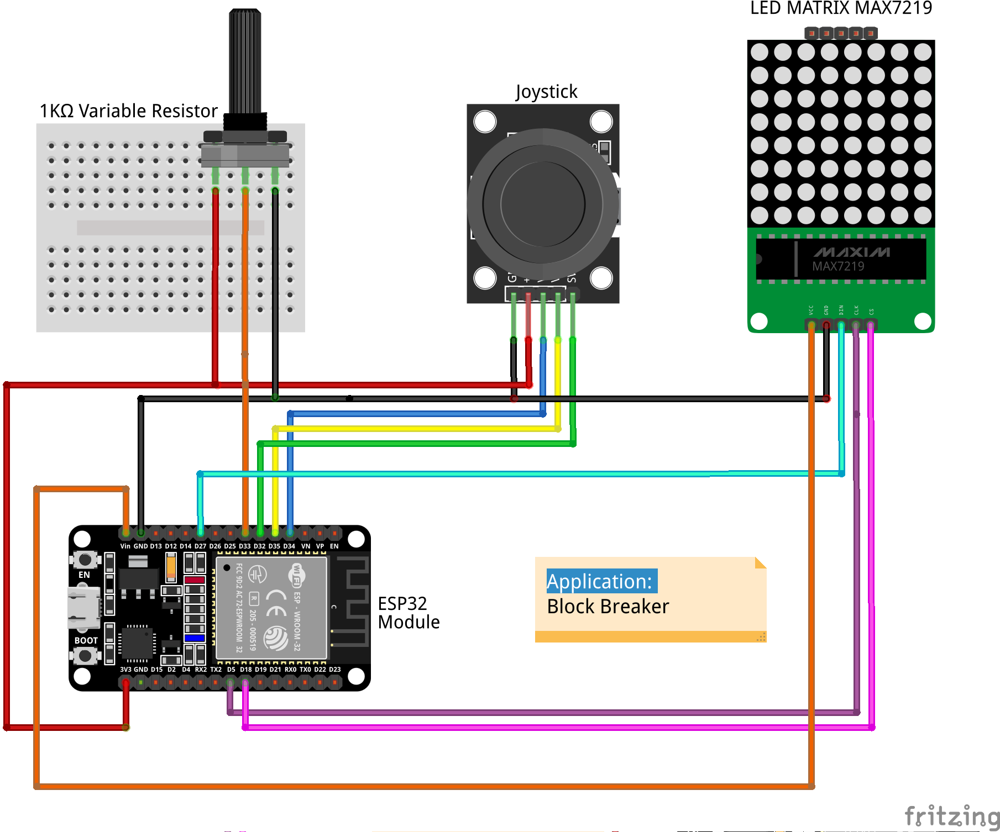
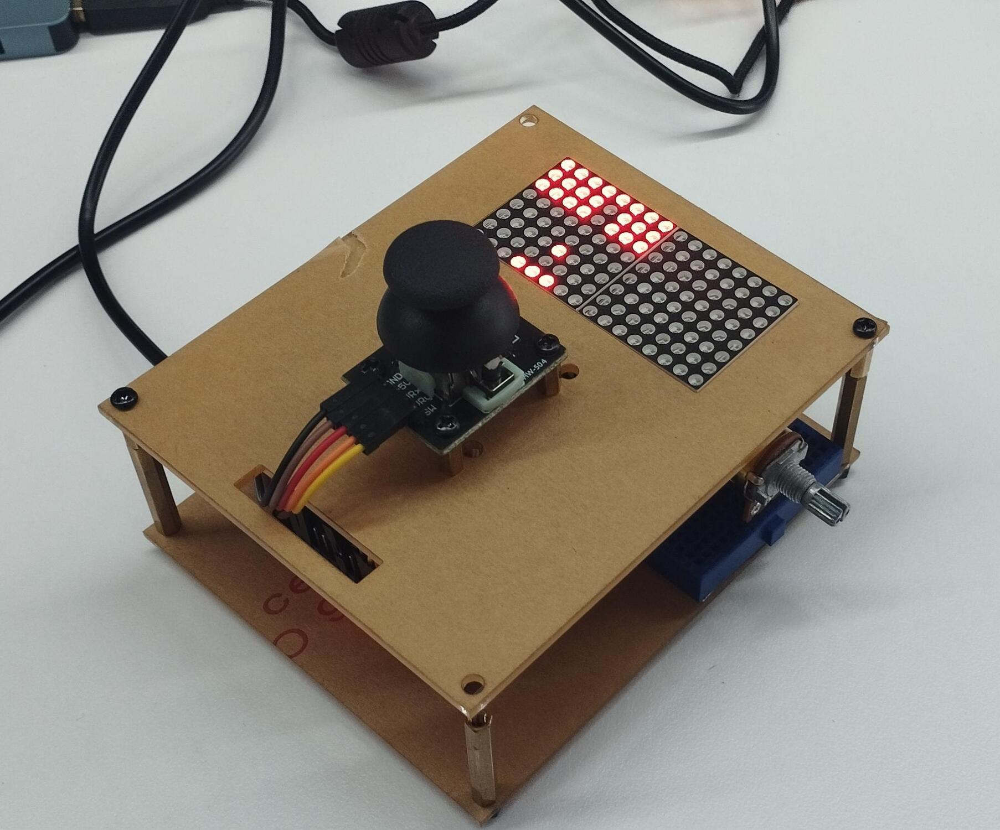

# Project: Block Breaker Game
Welcome to the project: `Block Breaker Game`.
The `Block Breaker Game` is the AtomVM application which uses the SPI communication protocol with ESP32 and MAX7219, ADC to read Joystick, Interrupt, Variable Resistor and uses Erlang to develop the Block Breaker Game.

To build this project, you should know about Joystick, Interrupt, Led matrix 8x8 with MAX7219, Variale Resistor. You can find the followings application: Led maxtrix 8x8, Joystick, GPIO interrupt and Snake Game Project to read more about technique we use. So in this file, we just present more about `Block Braker Game` and how it implementation.
## Block Breaker Game
### GPIO Connectivity
|ESP32_GPIO|Module Led matrix|Joystick|Variable Resistor|
|:------:|:-----:|:---:|:------:|
|35||VRy|
|34||VRx|
|33|||Vout|
|32||SW||
|27|Din||
|5|CLK||
|18|CS||

**Important note**: Because Esp32 is 3.3 voltage tolerant, so when you connect Vcc of Joystick and Variable resistor you must connect it to 3.3V to get correct ADC value. Led matrix will use Vin which is 5V.
### Features and Implementation
#### Block Breaker Game works as in legacy game.
We provide the legacy game, the feature including:
+   Led matrix 8x8 will be used to display everything.
+   Users can control the Cross Bar by changing the Joystick's position.
+   If the Ball collisions with the Point (which is on the top side of the Ledmatrix) this Point will be turned off.
+   If the Ball reaches the border, it will move in the opposite direction.
+   If the Ball collisions with the Coss Bar, it will move in the new direction according to which position it collision with the Cross Bar.
+   Game over event will be occured if the Ball reaches the bottom of Ledmatrix and there is no Cross Bar.
+   Game win event will be occured if user get Max Point.

Implementation:
Using Gen server behavior to control the Game, state of gen_server including:
+   `spi`: is the pid of the SPI peripheral.
+   `crossbar`: is the Maps contains current element of the Cross Bar.
+   `ball`: is the Maps contains current Ball's position.
+   `direction`: is the current direction of the Ball.
+   `point`: is the Maps contains all Point element's position.
+   `data`: is the data store in MAX7219.
+   `score`: is the current Score.
+   `isgameover`: is the status of game over or not.
+   `goverproc`: containsas  current pid of process handle display GAME OVER or GAME WIN text, it will be `undefined` if current `gameover` is `False`.

There are some handle_cast implement to control the snake, including:
+ `update_game`: update the current led matrix with current State of Gen server.
+ `reset_game`: handle reset game request.
+ `move_cross_bar`: moving the cross bar to the new position acording to the control by User through Joystick.
+ `move_ball`: moving the ball to the new direction acording to current direction which store in State of Genserver. This handle also trigger Game Win or Game Over event.
+ `display_game_win`: handle to display GAME WIN text.
+ `display_game_over`: handle to display GAME OVER text.

And `handle info({gpio_interrut, GPIOPin})` to trigger reset the game request.

We also create some another process to help us control the snake, including:
+   `game_over_process`: help us implement moving the GAME OVER text.
+   `game_win_process`: help us implement moving the GAME WIN text.
+   `variable_resistor`: help us read variable resistor which can help to change the Ball speed.
+   `joystick`: read ADC value from joystick then convert to the direction of the Cross Bar.
+   `ball` (parrent process): handle moving the snake with specific speed.

#### Game Implementation
This game contains three main part are: `Ball`, `CrossBar` and `Point` (Point is the things on the top position of Led matrix).
##### Implementation of moving the Ball
+   The `Ball` will moving acording to current the direction which store in the State of Gen server.
+   Process `ball` will call `gen_server:cast(move_ball)` after `currentspeed` delay.
+   When Gen server receive that request it will handle to move the ball by add `direction` with `ball` position. After that we delete current led in Led matrix which represent for the ball and print the new ball.
+   Because we delele the Ball and Print the new one if it move, so when it collision with the `Point` it will aslo delete the `Point` which it collision.
+   If the `ball` reach the border, we must change the direction of the ball.
+   If the `ball` collisions with the Coss Bar, it will move in the new direction according to which position it collision with the Cross Bar. (Posision middle -> Ball moving straight, position Left or Right -> Ball moving diagonal direction, the edge of the crossbar -> moving opposite to current direction and increase or reduce X unit by one).
+   Game Over event will occur if the Ball reaches the bottom of Ledmatrix and there is no Cross Bar.
+   Game Win event will occur if current Game Score is 24 which is the max point the user can get.

##### Implementation of moving the Cross Bar
+   Read the ADC value in X axis from Joystick, then convert to the direction which is -1 or 1.
+   Send request gen_server:cast(move_cross_bar) if the direction change.
+   Change the Crossbar position by delete current CrossBar and print the new one. We also update the `crossbar` which store in State of Gen server.

#### Display score and GAME OVER or GAME WIN text
In this procject, we will display score of current game section.
+   Get the first character by division Score by 10, then get appropriate macro with first character.
+   Get the second character by remainder Score by 10, then get appropriate macro with second character.
+   Merge two maps of first character and second character, then send data to display on led matrix.

We also display "GAME OVER" or "GAME WIN" text moving on ledmatrix.
+   Get 8 rows apporiate with the text.
+   Write to Led matrix to display.
+   Delay a litte bit then increase the Number of Times (this thing will help the text moving).
+   Repeat step one again with the new Number of Times.
+   Stop if user reset the game.

#### Change the Ball's speed
In this project, we provide method to change the ball's speed. We uses ADC to read value from the Variable Resistor. Then mapping this value to the range from MIN_SPEED to MAX_SPEED to get the new speed of the Ball.
Implementation:
+ Read ADC value from Variable Resistor after delay value is current ball's speed.
+ Check if the speed change or not, if speed don't change we will stop here. Otherwise go next.
+ Send new speed value to process which handle moving the Ball (also call as Parrent process).
### Example Result
**Hardware**

**Gameplay**
You can find the video to see the Gameplay.