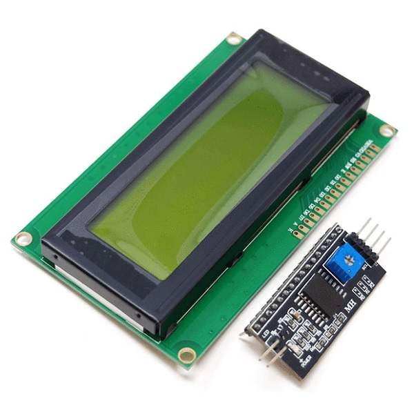
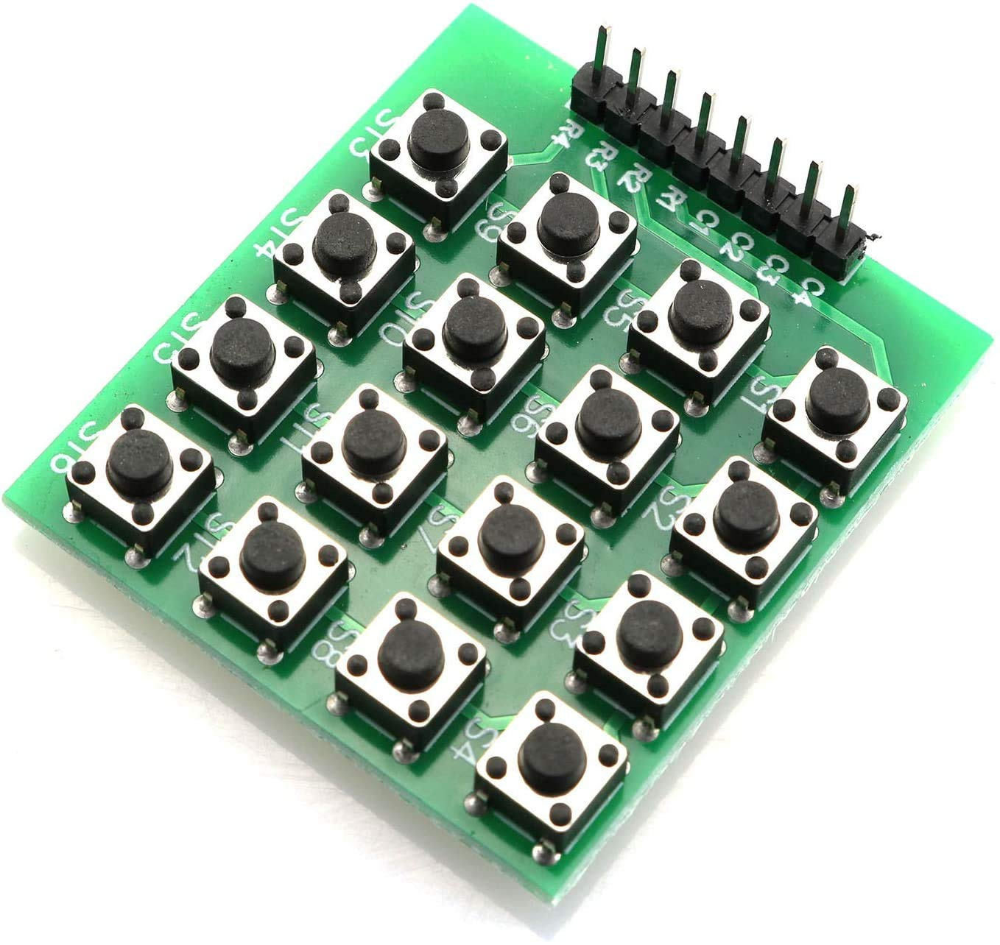
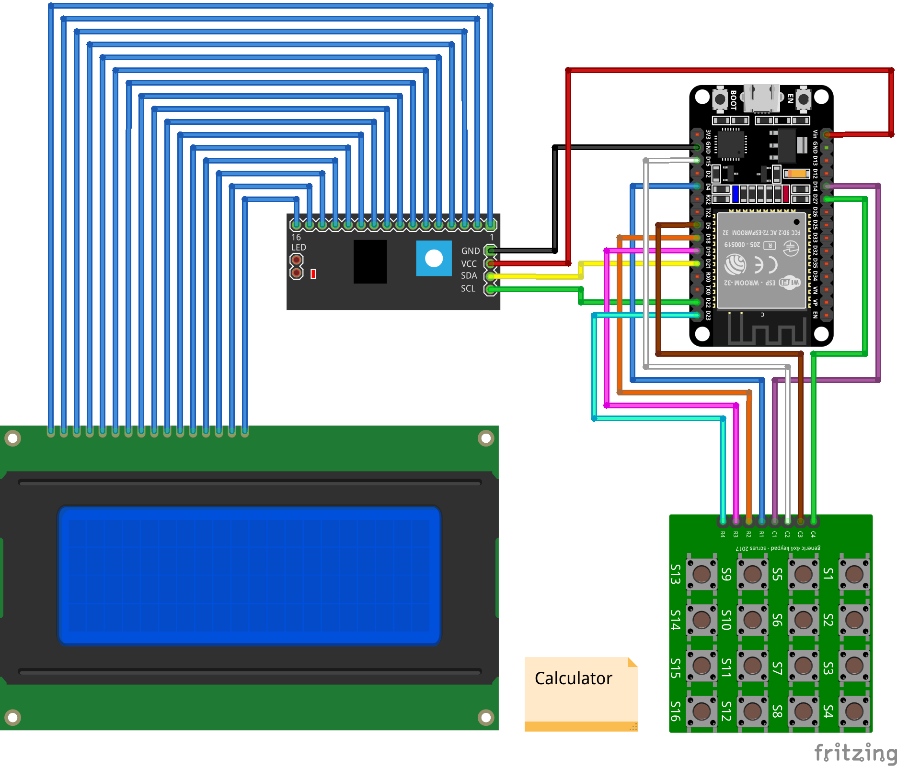
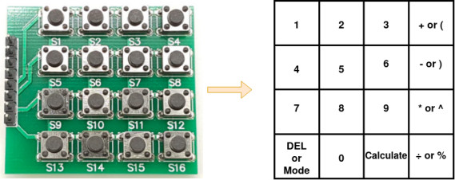

# Project: Calculator
Welcome to the project: `Calculator`.
The `Calculator` is the AtomVM application that uses the I2C communication protocol with ESP32 to comunicate with LCD 2004, read input Pin from Keypad 4x4, and uses Erlang to develop the `Calculator`.

To build this project, you should know about I2C with LCD 2004 and how to read input from Keypad 4x4. So in this file, we will talk about: LCD, Keypad and immplementation of Calculator.

## LCD 2004 with module I2C


LCD stands for Liquid Crystal Display.  LCD is a flat-paneled display. It uses liquid crystals combined with polarized to display the content. LCD uses the light modulation property of LCD. LCD is available both in Monochrome and Multicolor. It cannot emit light directly without a backlight. In some LCDs, It displays the content only with the help of a backlight in a dark place.

I2C LCD uses I2C communication interface to transfer the information required to display the content. I2C LCD requires only 2 lines (SDA and SCL) for transferring the data. So, the complexity of the circuit is reduced.

LCD 2004 interface is similar to LCD 1602, but the LCD Addressing of LCD 2004 is extended, it looks like this:

.gif)

So it will lead to the change when setting the Pointer of Lcd, we must follow the Lcd Addressing to get the correct position to display the character.
## Keypad


The buttons on a keypad are arranged in rows and columns. A 4X4 keypad has 4 rows and 4 columns. Beneath each key is a membrane switch. Each switch in a row is connected to the other switches in the row by a conductive trace underneath the pad. Each switch in a column is connected the same way – one side of the switch is connected to all of the other switches in that column by a conductive trace. Each row and column is brought out to a single pin, for a total of 8 pins on a 4X4 keypad. Pressing a button closes the switch between a column and a row trace, allowing current to flow between a column pin and a row pin.

The way to read keypad is explain following:

We need to set 4 Row is Output mode and the other 4 Column is Input mode. After that:
+ Step 1: Pull first Row into low.
+ Step 2: Read value from 4 Column.
+ Step 3: If there is Column is `low`, wait for that Column release the buttonn and then map to the value we want to use. Otherwise, there is no button trigger.
+ Step 4: Loop from Step 1 to Step 3 for the other Row (Row 2, 3 ,4).
+ Step 5: Finish one scan keypad, wait and go to the next scan.

## Shunting yard algorithm
In computer science, the shunting yard algorithm is a method for parsing arithmetical or logical expressions, or a combination of both, specified in infix notation. It can produce either a postfix notation string. The algorithm was invented by Edsger Dijkstra and named the "shunting yard" algorithm because its operation resembles that of a railroad shunting yard.

### The algorithm in detail
Note: This is a simple version of that algorithm we use to implement the `Calculator` project.
```
/* The functions referred to in this algorithm are simple single argument functions such as sine, inverse or factorial. */
/* This implementation does not implement composite functions, functions with a variable number of arguments, or unary operators. */

while there are tokens to be read:
    read a token
    if the token is:
    - a number:
        put it into the output queue
    - an operator o1:
        while (
            there is an operator o2 at the top of the operator stack which is not a left parenthesis,
            and (o2 has greater precedence than o1 or (o1 and o2 have the same precedence and o1 is left-associative))
        ):
            pop o2 from the operator stack into the output queue
        push o1 onto the operator stack
    - a left parenthesis (i.e. "("):
        push it onto the operator stack
    - a right parenthesis (i.e. ")"):
        while the operator at the top of the operator stack is not a left parenthesis:
            {assert the operator stack is not empty}
            /* If the stack runs out without finding a left parenthesis, then there are mismatched parentheses. */
            pop the operator from the operator stack into the output queue
        {assert there is a left parenthesis at the top of the operator stack}
        pop the left parenthesis from the operator stack and discard it
        if there is a function token at the top of the operator stack, then:
            pop the function from the operator stack into the output queue

/* After the while loop, pop the remaining items from the operator stack into the output queue. */
while there are tokens on the operator stack:
    /* If the operator token on the top of the stack is a parenthesis, then there are mismatched parentheses. */
    {assert the operator on top of the stack is not a (left) parenthesis}
    pop the operator from the operator stack onto the output queue

```
## Calculator
### GPIO Connection

|ESP32|LCD 2004 with I2C module|Keypad|
|:----:|:----:|:-----|
|GPIO 22|CLK||
|GPIO 21|SDA||
|GPIO 23||R4|
|GPIO 19||R3|
|GPIO 18||R2|
|GPIO 04||R1|
|GPIO 14||C1|
|GPIO 15||C2|
|GPIO 05||C3|
|GPIO 27||C4|

### Circuit Diagram


## Features and Implementation
### Features.

**The feature includes:**
+ Support expression contains operator: +, -, *, /, ^, %, open brackets and close brackets ().
+ Support 3 modes: Calculate, Clear (clear everything store in calculator include History), History (display history expression).

**User Guide**
+ Mapping between keypad 4x4 and keyboard:



*Note: The function behind "or" you must press more than 0.5s to trigger that function.*

+ Press Mode to change mode: Calculate mode, clear mode and history mode.
+ In Calculate mode: press button to create the expression then press Calculate to get the Ans, press Del to delete current character.
+ In Clear mode: press Calculate to delete everything.
+ In History mode: press "2" or "8" to change the history display. Press "5" to edit that history.
### Implementation
In this project, we use Gen server behavior to implement out project.

+ We read the keypad continuously to get the new character. If there is a new character, send the request contain new character to gen server.
+ Because we enter the expression in Infix order, so to get the Ans we use Shunting yard algorithm to remove brackets (if have) and convert Infix exp to Posfix exp. Final, calculate the Posfix expression to get the Ans.
+ In each times when user press Calculate, current mode is Calculate and the expression is valid, we store current data to List and when the user call in History mode, we extract the data from it and display to the user.
+ When user want to see another History data, we change the pointer to the next History data and get the appropriate data from History list and display.
+ In Clear mode, we reset the Server State and call to display the Calculate mode.
### Limitation
Currently, our `Calculator` project contains some limits as follows:
+ With the Ans float, LCD will print the round value of Ans.
+ Support a max 40 characters in the expression.
+ Support high range of Ans less than `10^15`.
+ With the operator %, we can't combine with another operator, otherwise it will raise Syntax ERROR.