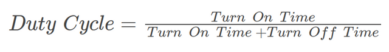
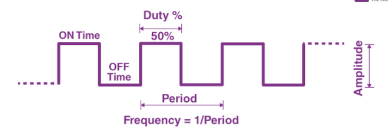
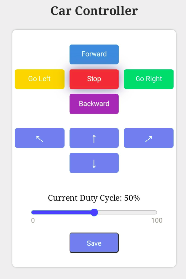

# `Car Control` Project
Welcome to the `Car Control using Webserver` project.
In this project, we will use the Webserver using HTTP request and ESP32 to control the Car.

## PWM
### What is PWM?
- Pulse width modulation reduces the average power delivered by an electrical signal by converting the signal into discrete parts.
- In the PWM technique, the signal’s energy is distributed through a series of pulses rather than a continuously varying (analogue) signal.

### Important Parameters associated with PWM signal:
#### Duty Cycle of PWM:
-  PWM signal stays “ON” for a given time and stays “OFF” for a certain time. The percentage of time for which the signal remains “ON” is known as the duty cycle.
-  If the signal is always “ON,” then the signal must have a 100 % duty cycle. The formula to calculate the duty cycle is given as follows:



- The average value of the voltage depends on the duty cycle. As a result, the average value can be varied by controlling the width of the “ON” of a pulse.

#### Frequency of PWM:
- The frequency of PWM determines how fast a PWM completes a period. The frequency of a pulse is shown in the figure above.
- The frequency of PWM can be calculated as follows:
    - Frequency = 1/Time Period
    - Time Period = On Time + OFF time



#### Output Voltage of PWM signal:
- The output voltage of the PWM signal will be the percentage of the duty cycle.
- For example, for a 100% duty cycle, if the operating voltage is 5 V then the output voltage will also be 5 V. If the duty cycle is 50%, then the output voltage will be 2.5 V.

## GPIO Connectivity
|ESP32_GPIO|L298N_Pin|DC MOTOR|
|:------:|:-----:|:---:|
|26|IN1_1|Wheel_1_1|
|4|IN2_1|Wheel_1_2|
|16|IN3_1|Wheel_2_1|
|17|IN4_1|Wheel_2_2|
|19|IN1_2|Wheel_3_1|
|21|IN2_2|Wheel_3_2|
|22|IN3_2|Wheel_4_1|
|23|IN4_2|Wheel_4_2|
|18|ENA1 & 2|PWM_CH0|
|13|ENB1 & 2|PWM_CH1|
**Note**
 + INx_1 means for first L298N and  INx_2 for second L298N.
 + Wheel_a_b means for wheel a and wire b.
 + GPIO 2 use to control Led when connect to the Wifi succesfully.
## Usage
### Structure of Project
This project is used for controlling the Car using webserver.
The Structure of Source code for Car project looks like similar to this:

```
├── ...
├── include
│   └── ledc.hrl
├── src
│   ├── config.erl
│   └── car_project.erl
└── README.md
```
+ config.erl file contain setting for connect to network.
> **IMPORTANT** before you compile and flash this example you need to edit `myssid` and `mypsk` in src/config.erl to match your wireless network configuration. You can also set-up port if you like.
```
    #{
        port => 8080,
        sta => [
            {ssid, esp:nvs_get_binary(atomvm, sta_ssid, <<"ssid">>)},
            {psk, esp:nvs_get_binary(atomvm, sta_psk, <<"password">>)}
        ]
    }.
```
+ ledc.hrl file contains some default macro when setup PWM.
+ car_project.erl file contains implementation about project.
### Feature and How to use
#### UI and Feature explain
Currently, we support UI looks like this:



+ When hold **Froward** button, car will move forward and when you release it, car will **Stop**. Similar to **Go Left**, **Go Right** and **Backward** button.

    ***Important Note***:
    + Because have delay between Client request and Server handle, so if you hold the 4 button above you must keep it for more extensive than 2s to get the correct action. If not, then there is only one request sent to Server.
    + When **Go Left** or **Go Right**, Duty cycle of one PWM  channel will be `50%` and another one is equal to value display on range slider, so make sure you adjust value in range slider larger than `50%` to get Go left or Go right action correct. The default value you can replace by change value in macro **PWM_LOW** in **car_project.erl**.
+ We also support moving without hold button, just press the following buttons, after that the Car will moving according to that arrow:
    + Button **North Arrow** will make car moving forward.
    + Button **South Arrow** will make car moving backward.
    + Button **North West Arrow** will make car moving left diagonal.
    + Button **North East Arrow** will make car moving right diagonal.
+ **Stop** button will make the Car stop moving.
+ In the range slider, you can ajust PWM duty cycle. Very simple, adjust the range slider value then press **Save**. The PWM duty cycle will update to Car and make it moving faster or slower.

#### Start Using
+ Turn on the switch on the Car.
+ Because currently we don't have any method to know IP address of ESP32 without using Serial terminal. So plug-in cable to computer, start **minicom** (or any serial terminal you likes). After that press **Reset** button on ESP32 Module.
+ At the end of the serial output, you should see output similar to:
```
    I (1822) NETWORK: SYSTEM_EVENT_STA_CONNECTED received.
    I (2822) event: sta ip: 10.9.163.210, mask: 255.255.254.0, gw: 10.9.162.1
    I (2822) NETWORK: SYSTEM_EVENT_STA_GOT_IP: 10.9.163.210
    Acquired IP address: "10.9.163.210" Netmask: "255.255.254.0" Gateway: "10.9.162.1"
```
+ Go to the Web with the link by format **IP:Port** where **Port** you configurate on **config.erl** file and **IP** you get from output of serial terminal. In this example of config.erl file above you should go to link https://10.9.163.210:8080 (Note that you must use the same network with your ESP32 Module).
+ Start using the car by press the buttons.