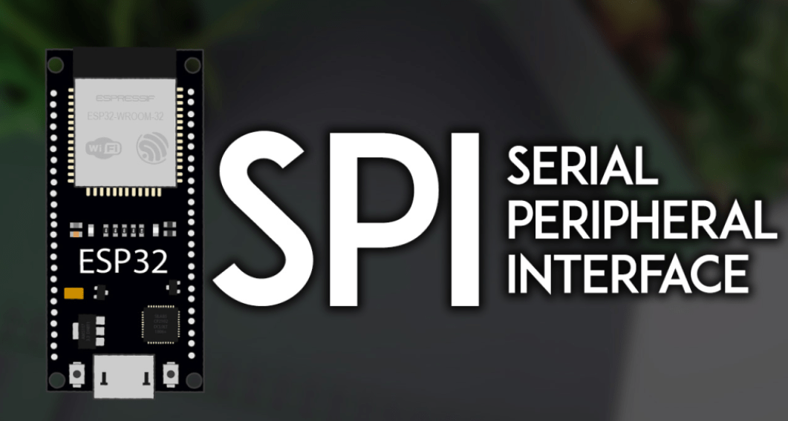
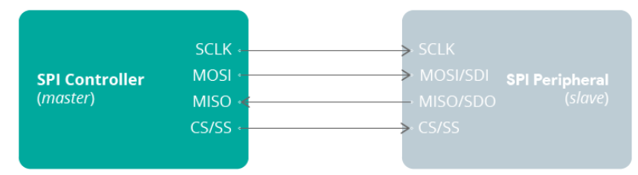
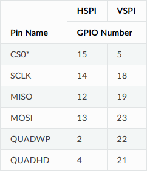
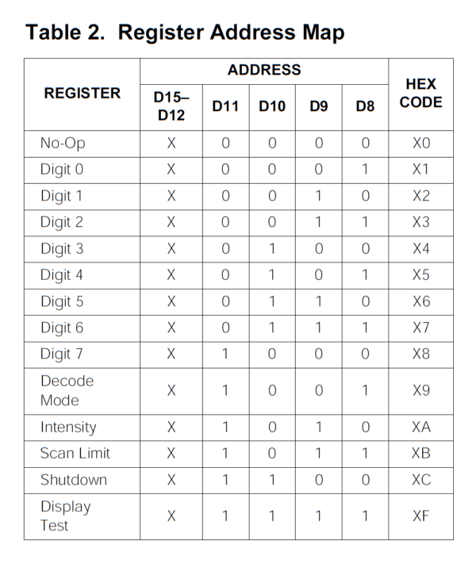
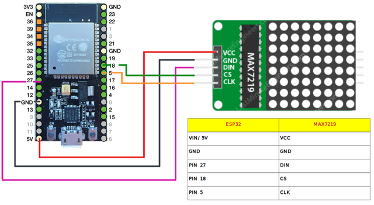
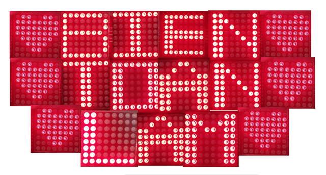

# Application: 8x8 Led Matrix

Welcome to the `8x8 Led Matrix` AtomVM application.
The `8x8 Led Matrix` AtomVM application uses the SPI communicate protocol with ESP32, and developing by Erlang to display `Heart` on the led matrix.

To build this project, you should know why using SPI protocol, how to connect SPI devices, define custom SPI pins, how to use multiple SPI devices, and much more.

## Introducing ESP32 SPI Communication Protocol
**SPI** stands for **S**erial **P**eripheral **I**nterface, and it is a synchronous serial data protocol used by microcontrollers to communicate with one or more peripherals. For example, your ESP32 board communicating with a sensor that supports SPI or with another microcontroller.
In an SPI communication, there is always a **controller** (also called master) that controls the **peripheral** devices (also called slaves). Data can be sent and received simultaneously.

You can have only one master, which will be a microcontroller (the ESP32), but you can have multiple slaves. A slave can be a sensor, a display, a microSD card, etc., or another microcontroller.

## SPI Interface
For SPI communication you need four lines:
- `MISO`: Master In Slave Out
- `MOSI`: Master Out Slave In
- `SCK`: Serial Clock
- `CS /SS`: Chip Select (used to select the device when multiple peripherals are used on the same SPI bus)

On a slave-only device, like sensors, displays, and others, you may find a different terminology:

- `MISO` may be labeled as SDO (Serial Data Out)
- `MOSI` may be labeled as SDI (Serial Data In)

## ESP32 SPI Peripherals and default PINS
The ESP32 integrates 4 SPI peripherals: `SPI0, SPI1, SPI2` (commonly referred to as `HSPI`), and `SPI3` (commonly referred to as `VSPI`).

`SP0` and `SP1` are used internally to communicate with the built-in flash memory, and you should not use them for other tasks.

You can use `HSPI` and `VSPI` to communicate with other devices. `HSPI` and `VSPI` have independent bus signals, and each bus can drive up to three `SPI` slaves.

Many ESP32 boards come with default SPI pins pre-assigned. The pin mapping for most boards is as follows:

**Note:** The above board is just adapt with ESP32 board, you should check your board carefully.

## Overview about MAX7219

LED matrix 8×8 is a system of 64 interconnected LEDs that are arranged in 8 columns and 8 rows. They are ideal for displaying letters, numbers, symbols, text, etc. Each column of the matrix contains the LED cathodes that are inside that column, while each row contains the LED anodes of that row.

To illuminate a particular LED, you need to connect a specific column in which the selected LED is located to the logical zero (LOW) and the row in which the LED is located to the logical one (HIGH). If we want to illuminate more LEDs at the same time, we connect the rows of selected LEDs to the logical one, while we connect the columns in which they are located to the logical zero. So for the control of all 64 LEDs, we need a total of 16 pins, i.e. digital outputs of the microcontroller.
That is too many necessary pins that can be used for connection of some other sensors or actuators. In order to solve this problem, we will connect the LED matrix to the MAX7219 driver.

Table 2 lists the 14 addressable digit and control register. The digit registers are realized with an on-chip, 8x8 dual-port SRAM. They are addressed directly so that individual digits can be updated and retain data as long as V+ typically exceeds 2V. The control registers consist of decode mode, display intensity, scan limit (number of scanned digits), shutdown, and display test (all LEDs on).
## Usage
Here the connection between **8x8 Led Matrix** and **ESP32 board**

### Output example

**Note:** You can change the output by change the value binary list in `display_heart` function in the main code.

