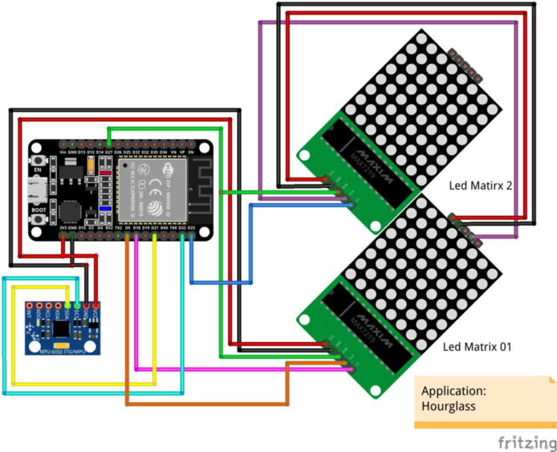
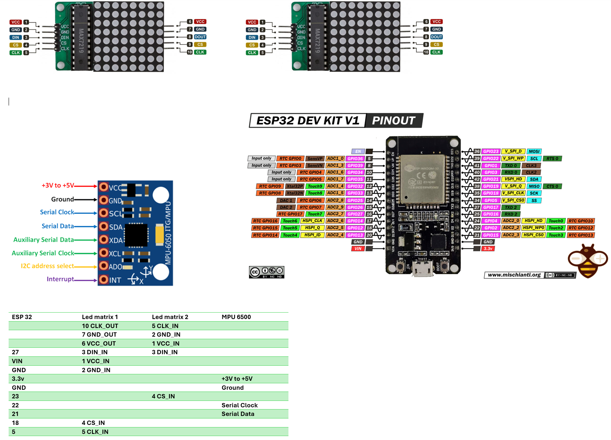

# Project: HourGlass
Welcome to the project: `HourGlass`.
The `HourGlass` is the AtomVM application that uses the SPI communication protocol with ESP32 and MAX7219, I2C to read MPU 6500, and uses Erlang to develop the `HourGlass`.

To build this project, you should know about Led matrix 8x8 with MAX7219, MPU6500. You can find the followings application: Led Maxtrix 8x8 and MPU6500 to read more about the technique we use. So in this file, we just present more about `HourGlass` and how its implementation.

## GPIO Connection
### Connection between ESP32 and Peripheral
|ESP32_GPIO|Led Matrix 01|Led Matrix 02|MPU 6500|
|:------:|:-----:|:---:|:------:|
|5|CLK||
|18|CS||
|21|||SDA|
|22|||SCL|
|23||CS|
|27|Din|Din|

### Connection between Led Matrix 01 and Led Matrix 02

|Led Matrix 01|Led Matrix 02|
|:----:|:----:|
|CLK|CLK|
|VCC|VCC|
|GND|GND|

### Circuit Diagram

## Features and Implementation
### Features.

The feature includes:

+ The module handles the initialization of the SPI (Serial Peripheral Interface) and MAX7219.

+ It sets up the MPU for accelerometer readings.

+ The hourglass is simulated using two LED matrices, and the state of the hourglass is represented using a 2D binary matrix for each LED matrix.

+ The hourglass can be rotated in different directions (top, bottom, left, right) using the MPU sensor readings.

+ It provides functions to move and drop seeds within the hourglass, simulating the flow of sand particles.

+ It controls the hourglass using a separate process to handle the MPU readings and update the hourglass accordingly.

## Implementation
In this project, we use the following component:

+ Two led matrix: Using SPI in Master - Multiple Slave model to control the Led matrix.

+ MPU6500: Using I2C to read the value from this sensor, then calculate the Angle (by using atan2 of AccX and AccY) and convert it to the Direction. With the current hardware assembly, we have the table to illustrate that:

|Angle|Direction|
|:------:|:-----:|
|[-100 : -80]|top|
|[80 : 100]|bottom|
|[160 : 180]|left|
|[-10 : 10]|right|

Note that we don't use the direct Angle and convert it to the Direction because have some errors when Reading the sensor value.

The behavior of HourGlass is implemented by doing two actions:
+ First, we will travel from the bottom to the top of Led (the bottom and top direction depend on `Direction` status). At each element of Led, we will check whether the element can move (down, left, or right) or not by combining it with the current `Direction` status. If yes, we will move that element by turning off the current led and turning on another led. That is how the element can move.
+ Second, after traveling all elements in the two Led matrix, we will check if we can drop one element from `top Led` to `bottom led` by checking the last element at the bottom of `top Led` and the first top element of `bottom led`. If the current `Direction` is Top or Bottom and the condition allows us to drop the element, then we will turn off and turn on the appropriate element to get the result.
+ The First and Second steps occur continuously by calling gen_server:call(move). We use gen_server:call and don't use gen_server:cast because we want to make sure the current moving is already done after calling the new `move` request.
+ If we change the position of the HourGlass, then the MPU will read the new value and send the new Direction to the server, and it will update the new Direction.
