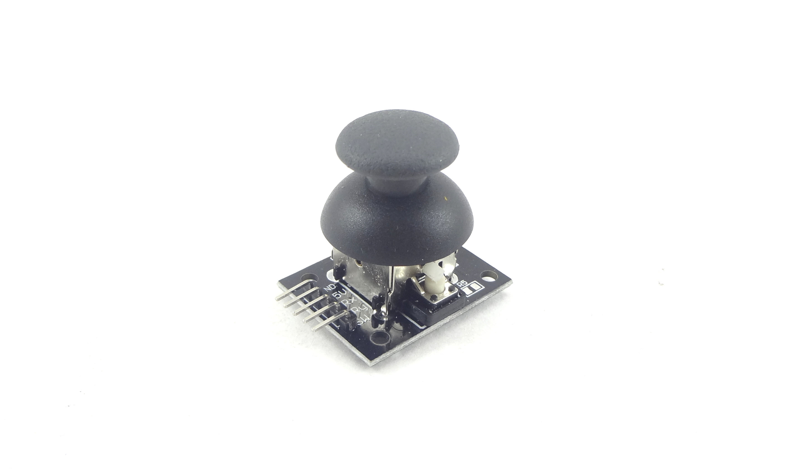
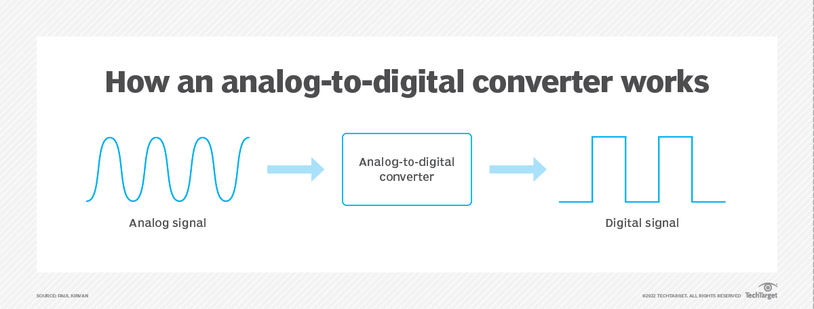
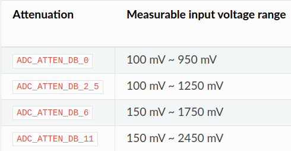
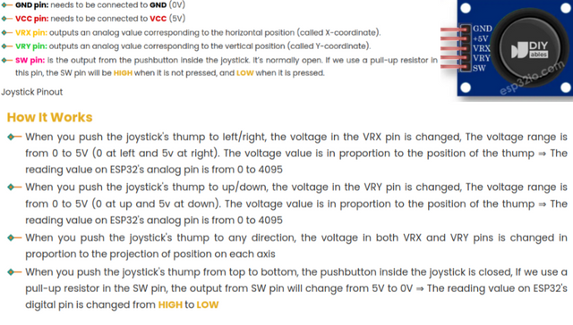
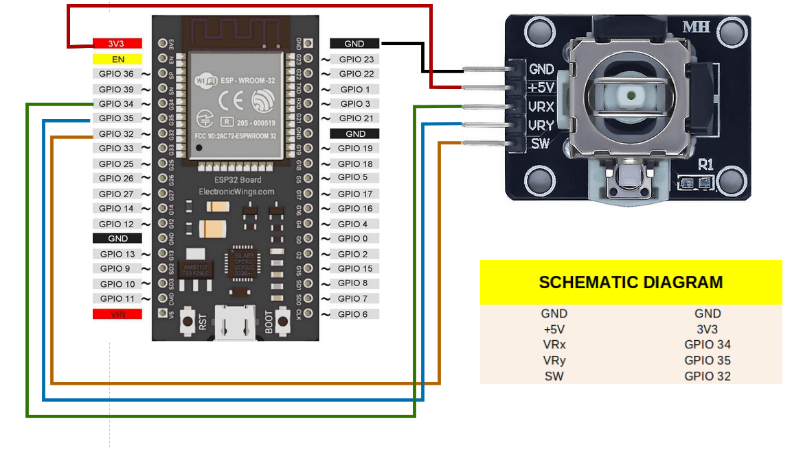
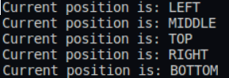

# Application: Joystick

Welcome to the `Joystick` AtomVM application.
The `Joystick` AtomVM application uses the ADC communication protocol with ESP32, and developing by Erlang to read and print the value of Joystick on the console.

To build this project, you should know why using ADC protocol, how Joystick works, how to connect Joystick to ESP32 and program for it, how to convert the values from Joystick to controllable values such as XY coordinates, the motor of UP/DOWN/LEFT/RIGHT direction.

## Overview of ADC
**Analog-to-digital** conversion (ADC) is an electronic process in which a continuously variable, or analog, signal is changed into a multilevel digital signal without altering its essential content.

An analog-to-digital converter changes an analog signal that's continuous in terms of both time and amplitude to a digital signal that's discrete in terms of both time and amplitude. The analog input to a converter consists of a voltage that varies among a theoretically infinite number of values. Examples are sine waves, the waveforms representing human speech and the signals from a conventional television camera.

The output of the analog-to-digital converter has defined levels or states. The number of states is almost always a power of two -- that is, 2, 4, 8, 16, etc. The simplest digital signals have only two states and are called binary. All whole numbers can be represented in binary form as strings of ones and zeros.

In this project, you should focus 2 values are: **ADC Attenuation** and **ADC bit_width**

### Attenuation
Vref is the reference voltage used internally by ESP32 ADCs for measuring the input voltage. The ESP32 ADCs can measure analog voltages from 0 V to Vref. Among different chips, the Vref varies, the median is 1.1 V. In order to convert voltages larger than Vref, input voltages can be attenuated before being input to the ADCs. There are 4 available attenuation options, the higher the attenuation is, the higher the measurable input voltage could be.

### bit_width

bit_width: Bit width configuration of ADC

## Introduction to Joystick Sensor
The Joystick is composed of two potentiometers square with each other, and one push button. Therefore, it provides the following outputs:
- An analog value (form 0 to 4095) corresponding to the horizontal position (called X-coordinate).
- An analog value (form 0 to 4095) corresponding to the vertical position (called Y-coordinate).
- A digital value of a pushbutton (HIGH or LOW).

The combination of two analog values can create 2-D coordinates with the center are valuse when the joystick is in the rest position.

### PINOUT

## USAGE

Here the connection between **Joystick** and **ESP32 board**

### Output example
You can get the below result by pushing the Joystick.
Eg: When you push the Joystick of thump to RIGHT you can get the result is "Current position is RIGHT" on the console.

**ATTENTION**

You should check file rebar.config carefully. In this project we use the ADC protocol, so the config file will change. It could be rewrited as follows:

        {erl_opts, [debug_info]}.
        {deps, [
            {atomvm_adc, {git, "https://github.com/atomvm/atomvm_adc.git", {branch, "master"}}}
        ]}.
        {plugins, [atomvm_rebar3_plugin]}.

