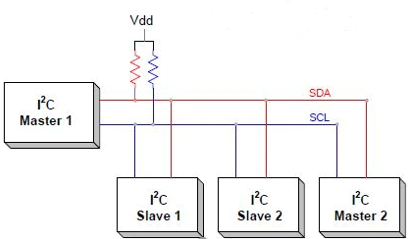
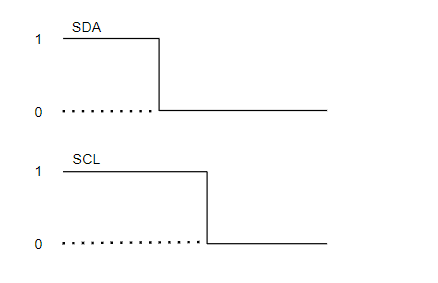
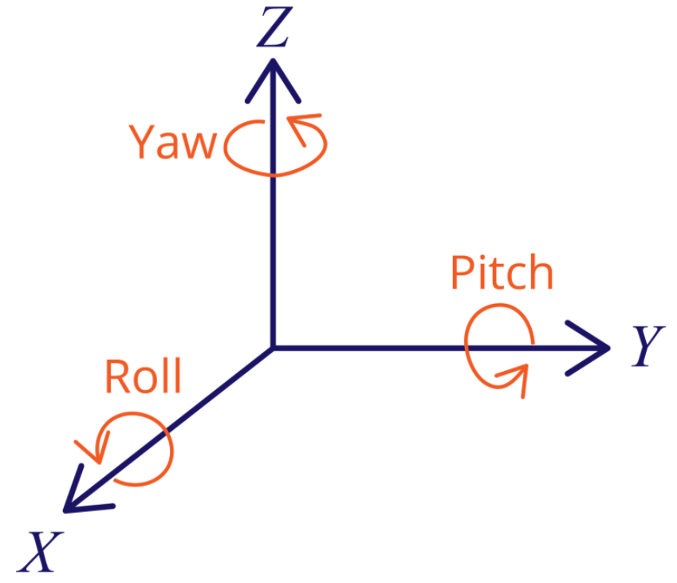
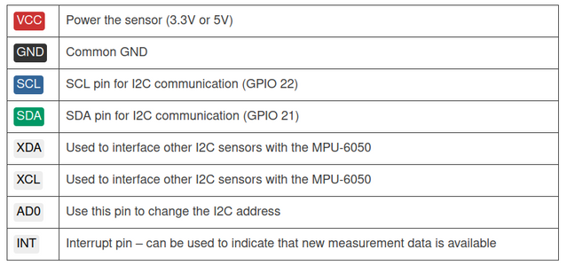
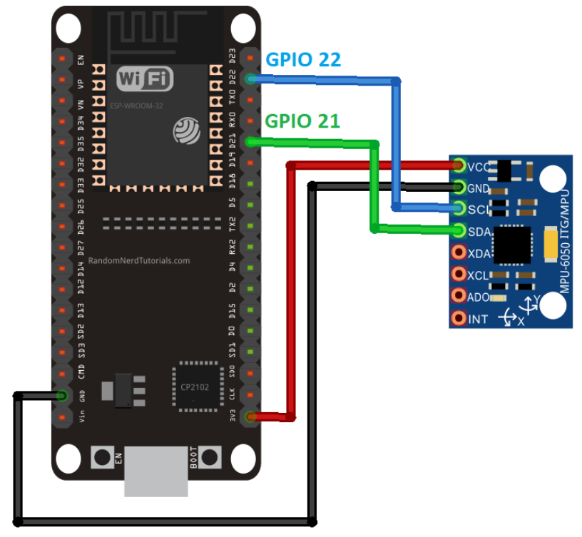
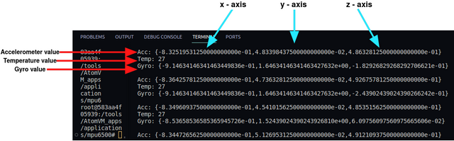

# `mpu6500 via I2C` Application

Welcome to the `mpu6500 via I2C` AtomVM application.
This application will demonstrates reading mpu6500 data via I2C.
The mpu6500 will read the value of accelerometer, gyro and temperature.
Before building the application, you should find out the base knowledges about I2C means and the definitions of accelerometer and gyro.

## I2C communications
### Definition
- I2C (Inter - Integrated Circuit) is a synchronous serial communication protocol developed by Philips Semiconductors, used to transmit and receive data between ICs using only two signal lines.
- The data bits will be transmitted bit by bit at regular intervals set by a clock signal.
- The I2C bus is often used to interface peripherals for many different types of ICs such as microcontrollers, sensors, EEPROMs, ... .

### Working Principles
#### Structure
- I2C uses 2 signal lines:

    - SCL - Serial Clock Line: Generates a clock clock transmitted by the Master
    - SDA - Serial Data Line: The line to receive data.

- I2C communication includes the process of transmitting and receiving data between Master - Slave devices.
- The Master device is a microcontroller, it is responsible for controlling the SCL signal line and sending and receiving data or commands through the SDA line to other devices.
- Devices that receive command and signal data from the Master device are called Slave devices. Slave devices are usually ICs, or even microcontrollers.
- Master and Slave are connected together as shown above. Both SCL and SDA buses operate in Open Drain mode, meaning that any device connected to this I2C network can only pull these two bus lines low (LOW), but cannot pull them. to a high level. Because to avoid the case that the bus is both pulled by one device to a high level and by another device to a low level, causing a short circuit. Therefore, a resistor (from 1 to 4.7 kΩ) is required to keep the default high.

#### Data transmission process
 - Start: The Master device will send a Start pulse by pulling the SDA and SCL lines from 1 to 0.
 - Next, Master sends the 7 address bits to Slave that wants to communicate with the Read/Write bit.
 - The Slave will compare the physical address with the address it was sent to. If there is a match, the Slave acknowledges by pulling the SDA line to 0 and setting the ACK/NACK bit to '0'. If there is no match, the SDA and ACK/NACK bits both default to '1'.
 - The Master device sends or receives a data bit frame. If the Master sends to the Slave, the Read/Write bit is set to 0. Otherwise, if received, this bit is set to 1.
 - If the frame has been successfully transmitted, the ACK/NACK bit is set to 0 to signal the Master to continue.
 - After all data has been successfully sent to the Slave, the Master will issue a Stop signal to notify the Slaves that the transmission has ended by switching SCL and SDA from 0 to 1, respectively.

## GYRO and Accelerometer
The gyroscope measures rotational velocity (rad/s), this is the change of the angular position over time along the X, Y and Z axis (roll, pitch and yaw). This allows us to determine the orientation of an object.

The accelerometer measures acceleration (rate of change of the object’s velocity). It senses static forces like gravity (9.8m/s2) or dynamic forces like vibrations or movement. The MPU-6050 measures acceleration over the X, Y an Z axis. Ideally, in a static object the acceleration over the Z axis is equal to the gravitational force, and it should be zero on the X and Y axis.

Using the values from the accelerometer, it is possible to calculate the roll and pitch angles using trigonometry. However, it is not possible to calculate the yaw.

We can combine the information from both sensors to get more accurate information about the sensor orientation.

In this application, the result of program will print the values of Temperature; GYRO and Accelerometer of x-axis, y-axis and z-axis.

## Usage

This is the PINOUT for the MPU6500 sensor module.

This is the connection between ESP32 and MPU6500.

### Example Result

This is the output of this application, it was printed on the console.
