# Project: Self balancing robot (Phase 1)
Welcome to the project `Self balancing robot (Phase 1)`.
This is the application using Erlang based on AtomVM environment include some algorithm such as PID, complementary filter,.... The self-balancing robot is a two-wheeled robot that balances itself so that it prevents from falling. To implement this project, we need to learn about the MPU9250, L298N H-Bridge, DC Motor. However you can find these examples in merged repository so we will concentrate on expressing Complementary filter and PID algorithm and finally is our self-balancing robot.

## Complementary filter
### Definition
- A complementary filter is a quick and effective method for blending measurements from an accelerometer and a gyroscope to generate an estimate for orientation. This webpage briefly explains why such a filter is necessary, how it works, and then offers some alternative filters that you might consider. As a case-study problem, we will consider estimating the tilt angle of an inverted pendulum.
### Algorithm
__Measuring Angle of Inclination Using Accelerometer__

- The MPU6050 has a 3-axis accelerometer and a 3-axis gyroscope. The accelerometer measures acceleration along the three axes and the gyroscope measures angular rate about the three axes.
- To measure the angle of inclination of the robot we need acceleration values along y and z-axes. The atan2(y,z) function gives the angle in radians between the positive z-axis of a plane and the point given by the coordinates (z,y) on that plane, with positive sign for counter-clockwise angles (right half-plane, y > 0), and negative sign for clockwise angles (left half-plane, y < 0).
- Try moving the robot forward and backward while keeping it tilted at some fixed angle. You will observe that the angle shown in your serial monitor suddenly changes. This is due to the horizontal component of acceleration interfering with the acceleration values of y and z-axes.

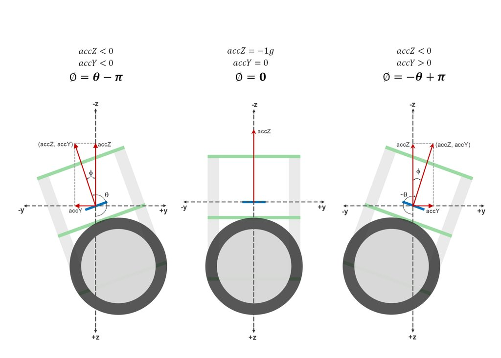

__Measuring Angle of Inclination Using Gyroscope__

- The 3-axis gyroscope of MPU6050 measures angular rate (rotational velocity) along the three axes. For our self-balancing robot, the angular velocity along the x-axis alone is sufficient to measure the rate of fall of the robot.
- The position of the MPU6050 when the program starts running is the zero inclination point. The angle of inclination will be measured with respect to this point.
- Keep the robot steady at a fixed angle and you will observe that the angle will gradually increase or decrease. It won’t stay steady. This is due to the drift which is inherent to the gyroscope.

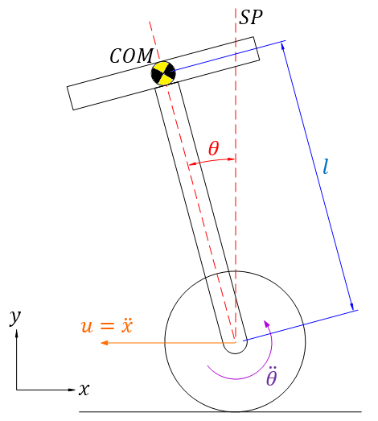

__Combining the Results With a Complementary Filter__

- We have two measurements of the angle from two different sources. The measurement from accelerometer gets affected by sudden horizontal movements and the measurement from gyroscope gradually drifts away from actual value. 
- In other words, the accelerometer reading gets affected by short duration signals and the gyroscope reading by long duration signals.
- These readings are, in a way, complementary to each other. Combine them both using a [Complementary Filter](http://d1.amobbs.com/bbs_upload782111/files_44/ourdev_665531S2JZG6.pdf) and we get a stable, accurate measurement of the angle. 
- The complementary filter is essentially a high pass filter acting on the gyroscope and a low pass filter acting on the accelerometer to filter out the drift and noise from the measurement.

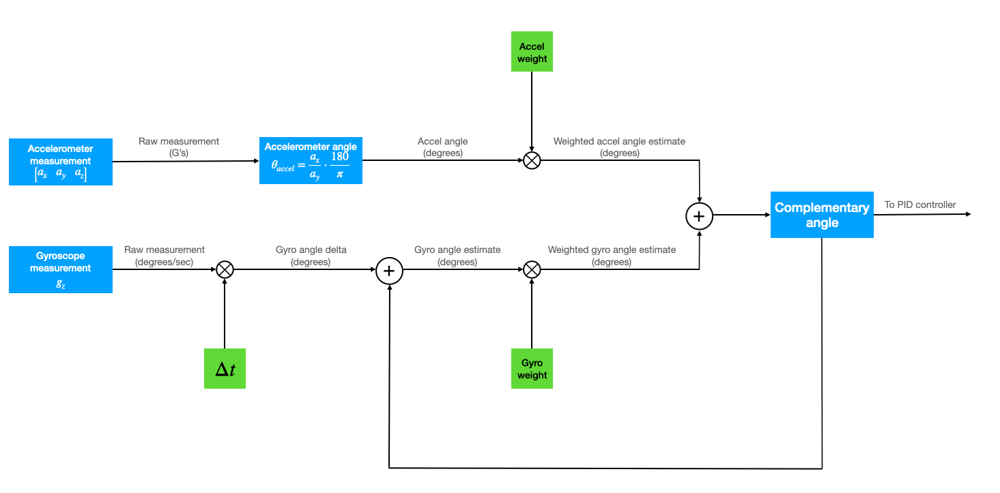

- We use this formula to calculate the exact current angle of the robot:

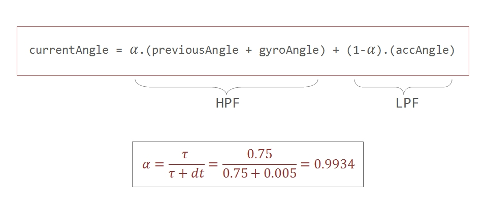

***Eliminating accelerometer and gyroscope offset errors :***

- Any error due to offset can be eliminated by defining the MPU9250's offset values

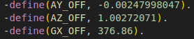

## PID controller
### Theory

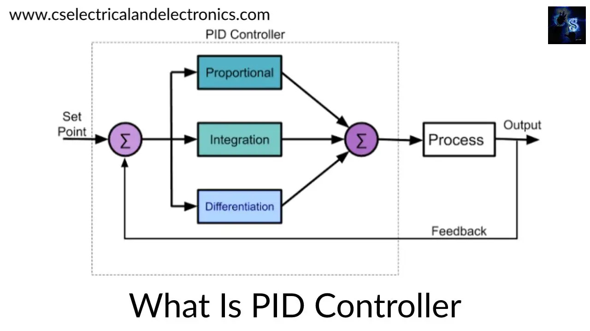

A proportional–integral–derivative controller (PID controller or three-term controller) is a control loop mechanism employing feedback that is widely used in industrial control systems and a variety of other applications requiring continuously modulated control.

A PID controller continuously calculates an error value e(t) as the difference between a desired setpoint (SP) and a measured process variable (PV) and applies a correction based on proportional, integral, and derivative terms (denoted P, I, and D respectively), hence the name.
PID stands for Proportional, Integral, and Derivative. Each of these terms provides a unique response to our self-balancing robot.
- The proportional term, as its name suggests, generates a response that is proportional to the error. For our system, the error is the angle of inclination of the robot.
- The integral term generates a response based on the accumulated error. This is essentially the sum of all the errors multiplied by the sampling period. This is a response based on the behavior of the system in past.
- The derivative term is proportional to the derivative of the error. This is the difference between the current error and the previous error divided by the sampling period. This acts as a predictive term that responds to how the robot might behave in the next sampling loop.

Multiplying each of these terms by their corresponding constants (i.e, Kp, Ki and Kd) and summing the result, we generate the output which is then sent as command to drive the motor.

### Tuning PID
Firstly, we have to know about the effects of __Kp__, __Ki__, __Kd__ on response of the robot. To be more straightforward and readable, we will summarize in the table:

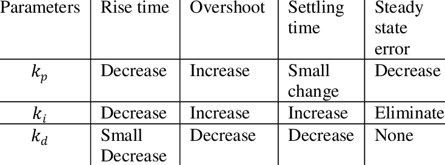

According to the table above, we are going to tune pid followed by steps:

1. Set __Ki__ and __Kd__ to zero and gradually increase Kp so that the robot starts to oscillate about the zero position.

2. Increase __Kd__ so that the response of the robot is faster when it is out of balance. __Kd__ should be large enough so that the angle of inclination does not increase. The robot should come back to zero position quickly if it is inclined.

3. Increase __Ki__ so as to reduce the oscillations. The error will also be eliminated by now.

4. Repeat the above steps by fine tuning each parameter to achieve the best result.

***Our final PID parameters :***

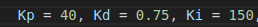

Finally we use this formula to evaluate the output of PWM to balance the robot:

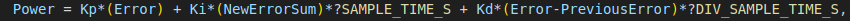

Our sampling time will be 10 miliseconds in this project based on reading I2C and calculate PWM duration.

## Self-balancing robot

### Concepts and implementation
As we have researched about PID and complementary befor, i will re-explain our idea and step to follow in this project:

1. Read accelerometer and gyroscope measurements from MPU-9250 via I2C protocol.
2. Take offset from these values to eliminate error as possible.
3. Using complementary filter to combine 2 angles gained before.
4. Applying PID algorithm and tuning __Kp__, __Ki__, __Kd__ until it get the best result.

### GPIO Connectivity

|ESP32_GPIO|L298N|MPU9250|
|:------:|:-----:|:---:|
|22||SCL|
|21||SDA|
|3V3||VCC|
|GND|GND|GND|
|16|IN1||
|14|IN2||
|5|IN3||
|23|IN4||
|19|EN1||
|18|EN2||
|VIN|+5V||

### Schematic model

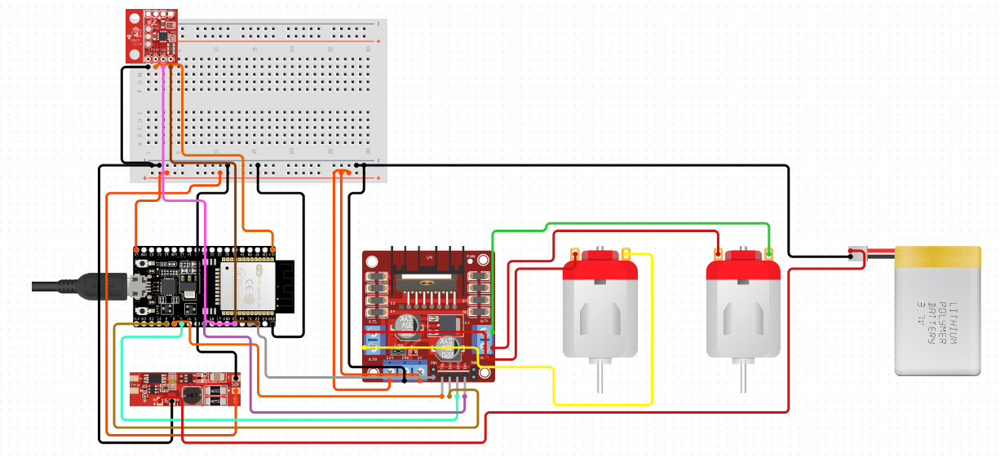

### Hardware model

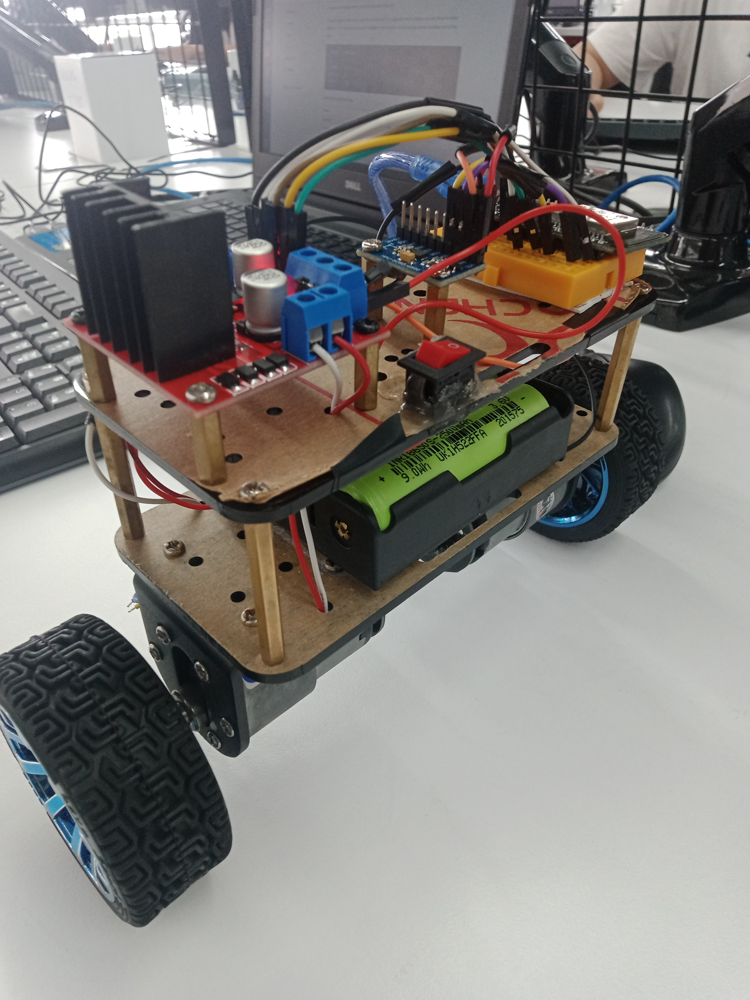

Unfortunately, our robot still cannot get the best balance situation so we will not share our video result here.