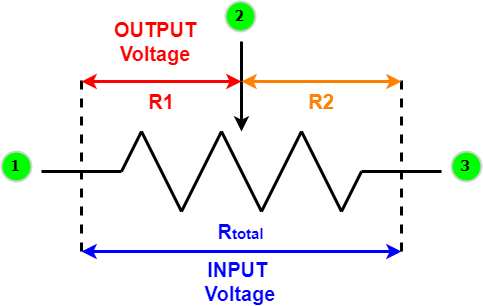
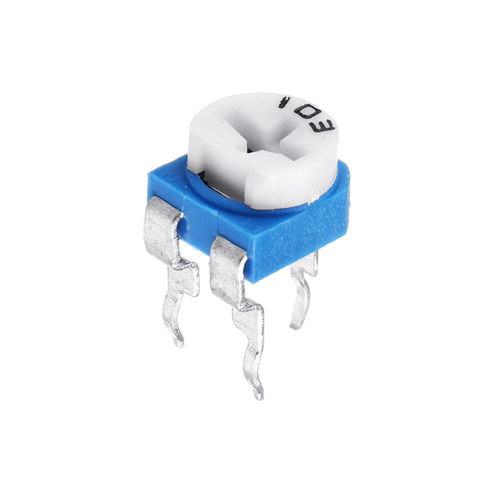
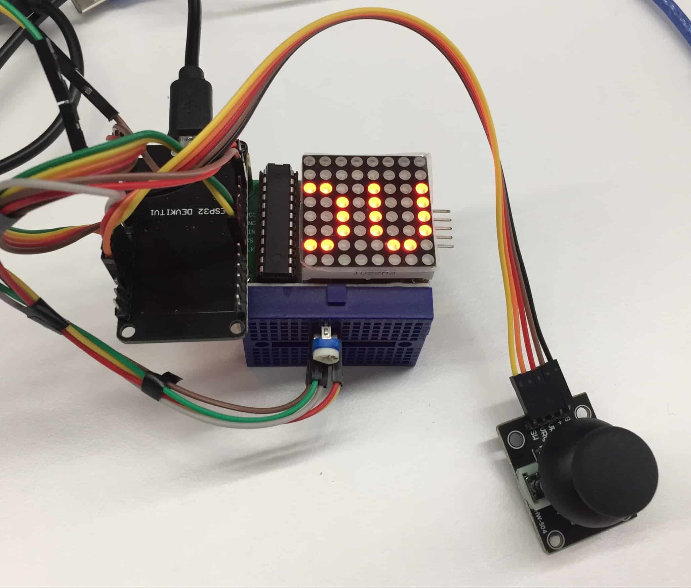

# Project: Snake Game
Welcome to the project: `Snake eat "Apple" Game`.
The `Snake eat "Apple" Game` is the AtomVM application which uses the SPI communication protocol with ESP32, ADC to read Joystick, Interrupt, Variable Resistor and uses Erlang to develop the Snake Game.

To build this project, you should know about Joystick, Interrupt, Led matrix 8x8 with MAX7219, Variale Resistor. You can find the followings application by read more: Led maxtrix 8x8, Joystick and GPIO interrupt. So in this part, we just present more about Variable Resistor and Snake Game and how it implementation.
## Overview of Variable Resistor
### What is a Variable Resistor?
- A variable resistor is a resistor of which the electric resistance value can be adjusted.
- A variable resistor is in essence an electro-mechanical transducer and normally works by sliding a contact (wiper) over a resistive element.

### Types of Variable Resistors:
- ***Potentiometer*** : used as a potential divider by using 3 terminals. The potentiometer is the most common variable resistor.
- ***Rheostat*** : Very similar in construction to potentiometers, but they use only 2 terminals instead of the 3 terminals that potentiometers use.
- ***Digital resistor*** : The change of resistance is not performed by mechanical movement but by electronic signals.

### Operation Principles of Variable Resistors:
- Although there are different types of variable resistors, their working principle is the same.
- Variable resistors allow you to adjust the value of voltage by changing the resistance and keeping current constant.
- To adjust the input voltage, a voltage source is connected to the terminals 1 and 3.

### Variable Resistor 10K:
- A **variable resistor 10K (103)** is a device that is used to change the resistance according to our needs in an electronic circuit.
- It can be used as a three-terminal as well as a two terminal device.
- Mostly they are used as a three terminal device.
- Variable resistors are mostly used for device calibration.

## Snake eat "Apple" Game
### GPIO Connectivity
|ESP32_GPIO|Module Led matrix|Joystick|
|:------:|:-----:|:---:|
|34||VRx|
|35||VRy|
|32||SW||
|27|Din||
|5|CLK||
|18|CS||

`Vout` from Variable Resistor will connect to `GPIO 33`.

**Important note**: Because Esp32 is 3.3 voltage tolerant, so when you connect Vcc of Joystick and Variable resistor you must connect it to 3.3V to get correct ADC value. Led matrix will use Vin which is 5V.
### Features and Implementation
#### Simple Snake Game
We provide the traditional snake game, including:
+   Snake will be displayed on the Led matrix 8x8.
+   Users can control the snake's direction by using Joystick.
+   If the snake eats "apple" it will increase one length and at the same time, the new apple will be spawned.
+   If the snake reach border, it will moving to the other side.
+   If the snake head reach itself, it will die and Game over.
+   Users press reset to play the new game.

Implementation:
Using Gen server behavior to control the Snake, state of gen_server including:
+   `spi`: is the pid of the SPI peripheral.
+   `snakehead`: is the Tuples {X, Y} contain position of current Snake's snake.
+   `snakebody`: is the Maps contain all Snake's position element.
+   `snakelen`: is the current len of the Snake.
+   `food`: is the current position of the Food.
+   `data`: is the data store in MAX7219. It will help us to blink the food.
+   `direction`: is the current direction of snake.
+   `gameover`: is the status of game over or not.
+   `goverproc`: containsasz  current pid of process handle display GAME OVER text, it will be `undefined` if current `gameover` is `False`.

There are some handle_cast implement to control the snake, including:
+   `move`: handle moving the snake. This we will discuss detail later.
+   `change_direction`: handle change the direction of the snake.
+   `display_game_over`: handle display GAME OVER moving text.
+   `turn_on_food` and `turn_off_food`: handle blink the food.

And `handle info(gpio_interrut)` to handle reset the game.

We also create some another process to help us control the snake, including:
+   `game_over_process`: help us implement moving the GAME OVER text.
+   `blink_food`: help us send request which handle blink food to the server.
+   `variable_resistor`: help us read variable resistor which can help to change the snake speed.
+   `loop` (parrent process): handle moving the snake with specific speed.

**How the Snake can move?**
Very simple, because we use Maps to store Snakebody, so if Client send request `move` we will do the following things:
+   Calculate the new snake's head with current position head and direction.
+   Handle border.
+   If new head eat `apple`, add new element which position is current apple position to the Snake body, increase the snake length, spawn new apple. Otherwise update new Snake body by shift left element (the current key will be assiged to the next key) in the Snake body (the last element will be assign to the new Snake head).
+   Handle Game over case.
+   Convert New Snake body to Data which can display snake in the led matrix and send data to the led matrix using SPI.
+   Update new state of Gen server.
#### Display score and GAME OVER text
In this procject, we will display score of current game if the snake die.
+   Get the first character by division Score by 10, then get appropriate macro with first character.
+   Get the second character by remainder Score by 10, then get appropriate macro with second character.
+   Merge two maps of first character and second character, then send data to display on led matrix.

We also display "GAME OVER" text moving on ledmatrix.
+   Get 8 bits of each row from the Maps macro appropriate with "GAME OVER" text. We apply some bitwise to get result (read the code to understand more).
+   Write to Led matrix to display.
+   Delay a litte bit then do the step one again.
+   Stop if user reset the game.

#### Change the Snake's speed
In this project, we provide method to change the snake's speed. We uses ADC to read value from the Variable Resistor. Then mapping this value to the range from MIN_SPEED to MAX_SPEED to get the new speed of snake.
Implementation:
+ Read ADC value from Variable Resistor after delay value is current snake's speed.
+ Check if the speed change or not, if speed don't change we will stop here. Otherwise go next.
+ Send new speed value to process which handle moving the snake.
### Example Result
**Hardware**

**Gameplay**

You can open the `Snake-Game-Demo.MOV` file to see the gameplay. (The video store in `(../snake_game/assets/Snake-Game-Demo.MOV)`).