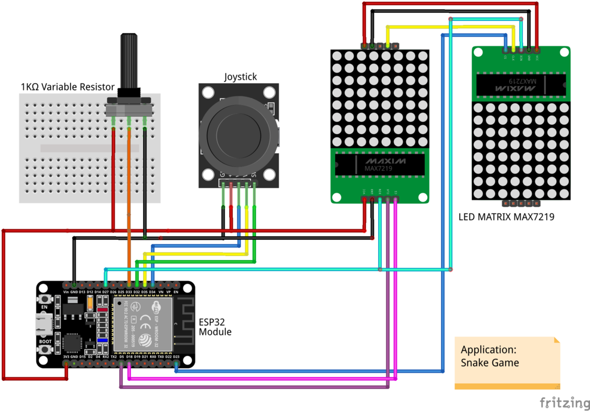

# Project: Snake Game with Two Led Matrix
## Other note
This application is base on `Project: Snake Game with one Led matrix`. In this project, we just change the data structure of the State of Gen Server, we add one variable which defines which led we should use to display and handle some cases when the Snake reaches the border. You can read the README file in `../snake_game` to get more detail about Snake Game.
## Schematic
