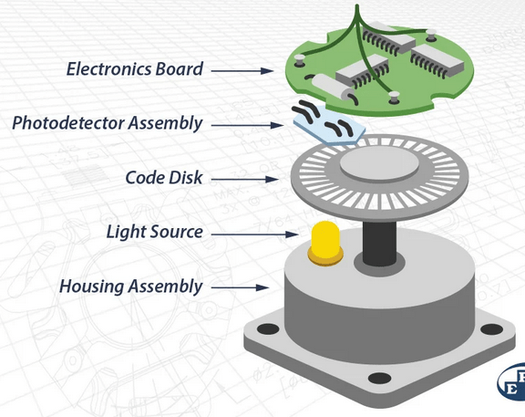
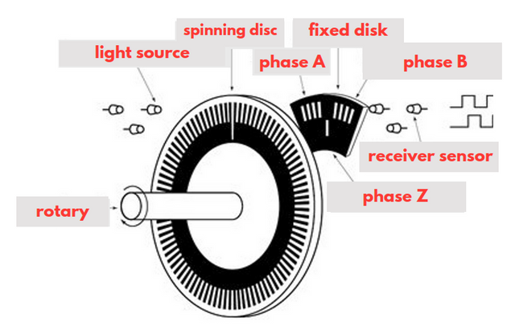
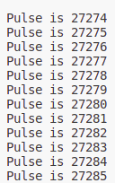
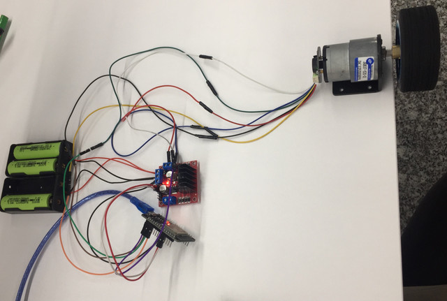

# `encoder` Application
- Welcome to the **encoder** application.
- This application will demonstrate reading encoder data.
## Understood encoder:
### What is an encoder?
- **Encoders** are used in machinery for motion feedback and motion control.
-  You'll find **encoders** used in cut-to-length applications, plotters, robotics, packaging, conveying, automation, sorting, filling, imaging, and many, many more.
- **Encoder** is a sensing device that provides feedback.
- **Encoders** convert motion to an electrical signal that can be read by some type of control device in a motion control system.
- The **encoder** sends a feedback signal that can be used to determine position, count, speed, or direction. A control device can use this information to send a command for a particular function.
- In any application, the process is the same: a count is generated by the **encoder** and sent to the controller, which then sends a signal to the machine to perform a function.

### How does an encoder work?
- **Encoders** use different types of technologies to create a signal, including: mechanical, magnetic, resistive and optical – optical being the most common. In optical sensing, the **encoder** provides feedback based on the interruption of light.

##### The basic construction of an incremental rotary encoder using optical technology:
- A beam of light emitted from an LED passes through the Code Disk, which is patterned with opaque lines *(much like the spokes on a bike wheel)*.
- As the **encoder** shaft rotates, the light beam from the LED is interrupted by the opaque lines on the Code Disk before being picked up by the Photodetector Assembly.
- This produces a pulse signal: light = on; no light = off. The signal is sent to the counter or controller, which will then send the signal to produce the desired function.



### What's the difference between absolute and incremental encoders?
- **Encoders** may produce either incremental or absolute signals. Incremental signals do not indicate specific position, only that the position has changed.
- Absolute **encoders**, on the other hand, use a different “word” for each position, meaning that an absolute **encoder** provides both the indication that the position has changed and an indication of the absolute position of the **encoder**.

## How to read encoder:
- When the disc rotates around the axis, there are grooves on the disc for the optical signal to shine through (LED).
- Where there is a groove, light can pass through, where there is no groove, light cannot penetrate.
- With the signal yes/no, it is recorded whether the LED shines through or not.
- The number of **Encoder** pulses is conventionally defined as ***the number of times the light passes through the slit***.
- For example, on a disk with only 100 slots, for every 1 revolution, the encoder counts 100 signals. This is the operating principle of the basic Encoder, but for many other types, of course, the rotating disc will have more holes and the received signal will also be different.



- The light-collecting sensor will turn on and off continuously, from which:
    - Generates square pulse signals.
    - The pulse signal will be transmitted to the central processor to measure and determine the position / speed of the motor.

## Usage:
- Create file:
``` sh
    rebar3 new lib encoder
```
- Change `rebar.config` file:
``` sh
    {erl_opts, [debug_info]}.
    {deps, []}.
    {plugins, [
        atomvm_rebar3_plugin, erlfmt
    ]}.
```

## Result:
- Result printed to console:



- Wiring result:


